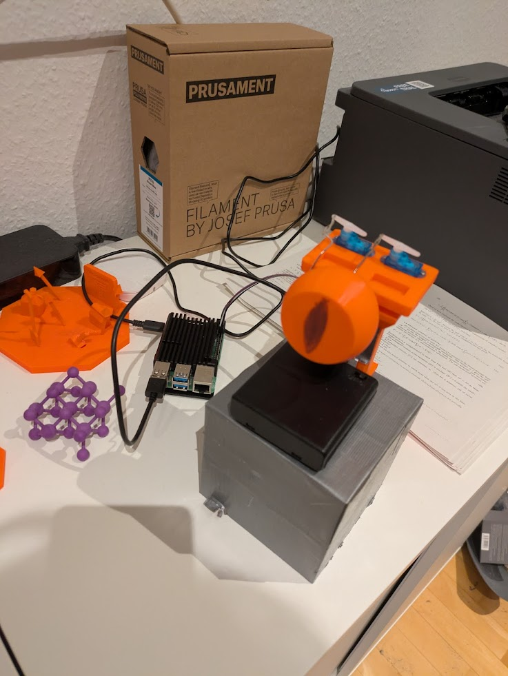

# Servo-Controlled Eye

This is a python project for a servo controlled eye with a USB webcam. The project is meant to be run on a raspberry pi 4B (but will probably work on any raspberry pi).

The project uses the huggingface transformers library with [clipseg](https://huggingface.co/docs/transformers/model_doc/clipseg) to be able to focus the eye on any object inside its vision cone named via text input.
It can also do face tracking so the eye follows the user as he moves around.
The eye is based on a heavily modified version of the [animatronic eye on printables](https://www.printables.com/model/278169-animatronic-eye). It uses two DPower AS-107BB nano servo motors.

To run the project please run `src/look_around_servokit.py`.

Video:
data/video/demo.mp4

## Build-Details

### Schematics

Fritzing Sketch under `data/fritzing/sketch.fzz`

### Parts and Tools List

* 2x AS-107BB Servo Motors
* armature wire
* Raspberry Pi 4B
* USB webcam (ideally with wide angle view)
* 5V DC power supply/ 4 AA-Batteries + Battery Holder
* Adafruit PCA9685 16x servo driver

Tools:
3D printer, precision mechanics screwdriver and screws, sticky tape

### Build Steps
1. 3D print the eye and socket-connector from the printables link
2. 3D print the servo holder and stand from the `data/blender` folder
3. Insert USB camera in stand (might need sticky tape), screw servos into holder and screw eye socket connector to the servo-holder
4. wire up the servos and the 5V power supply to the servo driver
5. wire up usb cam and servo driver to raspberry pi
6. bend armature wires and connect eye with servo motors (might need to enlargen the holes in the servo arms depending on armature wire thickness)

### Images

## Software Details

### Clipseg
[clipseg](https://huggingface.co/docs/transformers/model_doc/clipseg) is used for determining relevant features in the webcam feed given a text input.
The feature with the highest logits is selected as the spot to focus the eye on.
Currentyl the logic to move the eye is very simple and just uses a very rough localization of the center of gravity of the focus point inside one of 9 parts of the image to determine where the eye should move.
Clipseg is small enough that it can run on the raspberry pi directly within a few seconds when applied to small images. For speedup, an api based approach could be used in the future.

Example:  
  
Clipseg feature for text entry "hi-viz jacket"

### Face tracking

The project uses the [face tracking via haar cascades provided by opencv](https://docs.opencv.org/4.x/d2/d99/tutorial_js_face_detection.html). It's using the nonlinear [Fermi function](https://en.wikipedia.org/wiki/Fermi%E2%80%93Dirac_statistics)/[logistic function](https://en.wikipedia.org/wiki/Logistic_function) to translate the center point of the face in pixel coordinates to the angles of the eye/servos.
